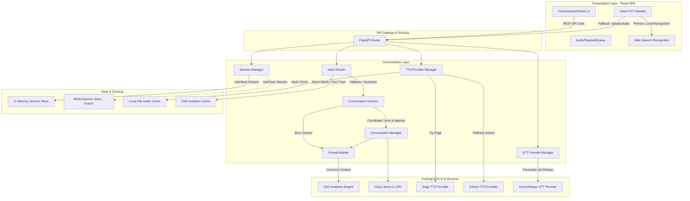
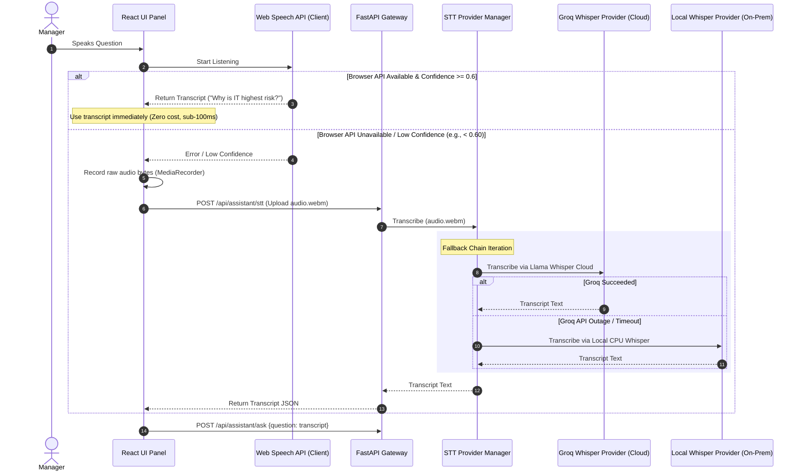
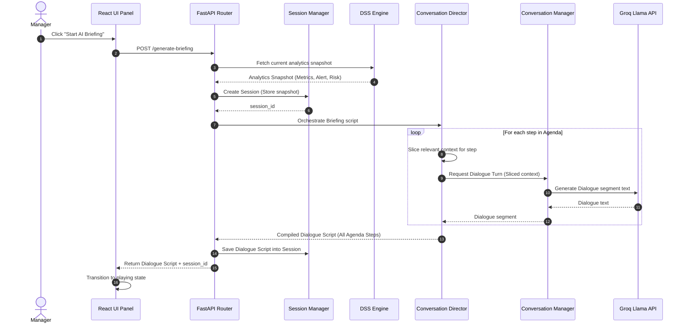
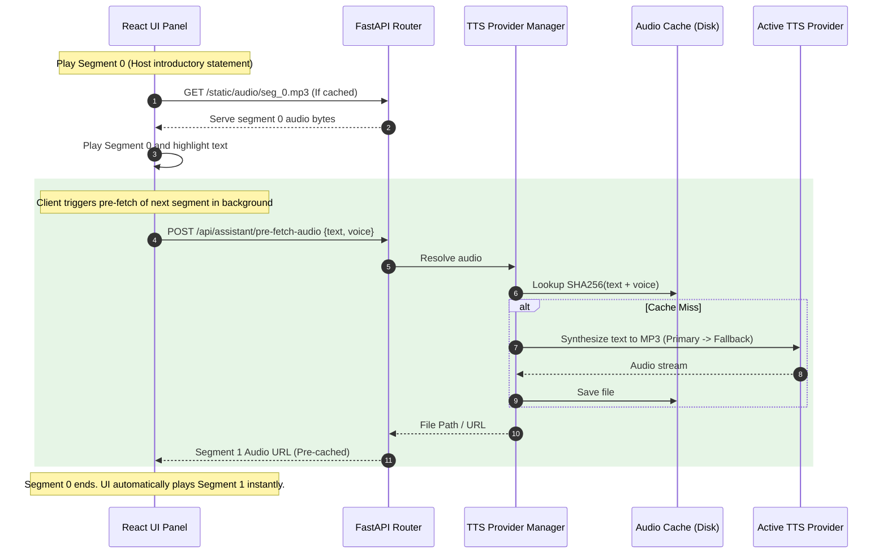
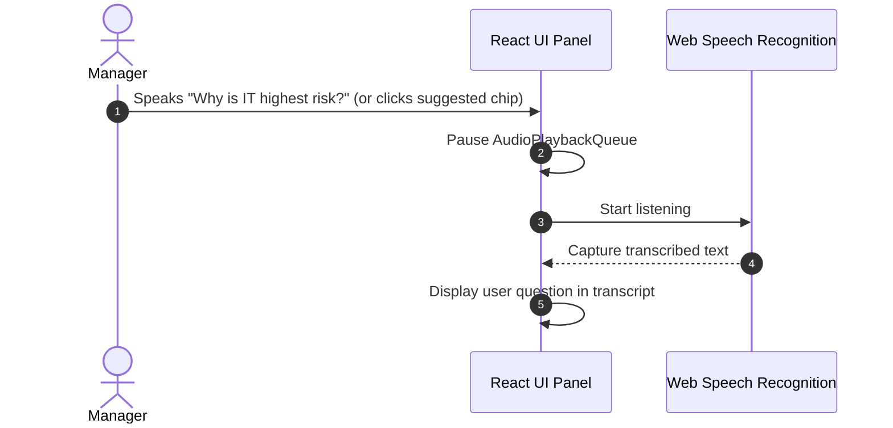
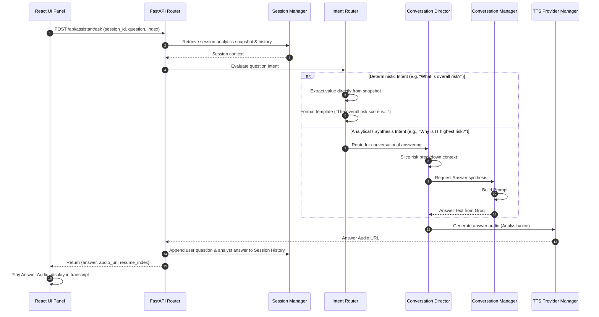
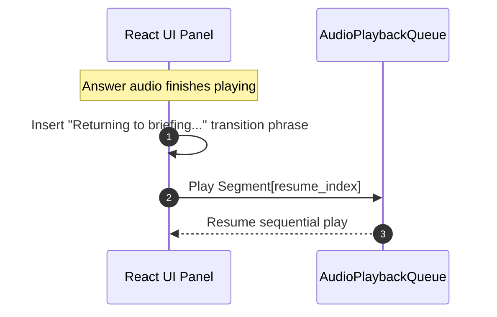
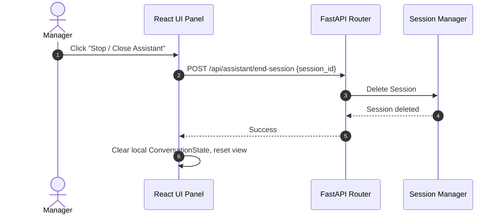
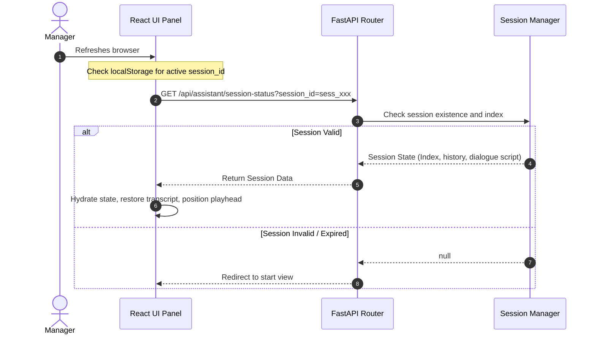

# Software Architecture Document (SAD)
## AI Executive Voice Briefing Assistant

**Author**: Lead Systems Architect  
**Version**: 1.2.0  
**Status**: Approved with Conversation Director & Refinements  

---

## 1. High-Level Architecture & System Topology

The AI Executive Voice Briefing Assistant is built as an interactive, voice-first orchestration layer on top of the existing Decision Support System (DSS). It maintains a clean separation between the presentation layer, the orchestration backend, and downstream intelligence/speech services.



---

## 2. Component Responsibility Matrix

| Component | Responsibility | Dependencies |
| :--- | :--- | :--- |
| **API Gateway / Router** | Exposes the HTTP endpoints, validates request payloads, and handles file serving for cached audio. | `Session Manager`, `Intent Router`, `TTS Provider Manager`, `STT Provider Manager` |
| **Session Manager** | Manages session state lifecycle, serializes/deserializes session contexts, and abstracts the underlying storage mechanism. | `SessionStore Interface` |
| **Intent Router** | Intercepts questions. Routes deterministic queries directly to the DSS cache (fast-track) and passes complex reasoning queries to the LLM. | `DSS Cache`, `Conversation Director` |
| **Conversation Director** | Dictates the briefing agenda, schedules speaker turns (Host/Analyst), manages pacing, injects dynamic transitions, and slices analytical context. | `Conversation Manager`, `Prompt Builder` |
| **Conversation Manager** | Orchestrates LLM calls, maintains conversation memory, formats the output, and ensures persona compliance. | `Prompt Builder`, `Groq API` |
| **Prompt Builder** | Injects the active DSS analytical data, system instructions, and user query into the Groq template. | `DSS Engine` |
| **TTS Provider Manager** | Resolves audio files. Checks local cache first; on cache miss, executes the configured TTS fallback chain. | `BaseTTSProvider Interface`, `Audio Cache` |
| **STT Provider Manager** | Manages server-side transcription when client-side capture fails. Iterates through STT providers to transcribe audio files. | `BaseSTTProvider Interface` |
| **Audio Playback Queue** | Manages the sequential playing, pausing, resuming, and pre-fetching of audio tracks on the client side. | `React State` |

---

## 3. Folder Structure (Backend - Recommendation Service Module)

```
ai_services/recommendation/
│
├── assistant/                         # New Voice Assistant Module
│   ├── __init__.py
│   ├── routes.py                      # FastAPI endpoint definitions & payload validation
│   │
│   ├── services/
│   │   ├── session.py                 # SessionManager & SessionStore abstractions (In-Memory/Redis)
│   │   ├── router.py                  # IntentRouter (Deterministic lookup vs. LLM)
│   │   ├── director.py                # ConversationDirector (Agenda, pacing, transition, context-slicing)
│   │   ├── conversation.py            # ConversationManager orchestrating Groq dialogue
│   │   ├── tts_manager.py             # TTSProviderManager with configurable fallback chain
│   │   └── stt_manager.py             # STTProviderManager with backend fallback chain
│   │
│   ├── prompts/
│   │   ├── builder.py                 # Dynamic system & user prompt templates compiler
│   │   └── templates.py               # Raw YAML/text prompt definitions
│   │
│   ├── providers/                     # Extensible TTS and STT engines
│   │   ├── base_tts.py                # BaseTTSProvider abstract class
│   │   ├── base_stt.py                # BaseSTTProvider abstract class
│   │   ├── edge_tts.py                # Microsoft Edge TTS Implementation
│   │   ├── kokoro_tts.py              # Kokoro local TTS Implementation
│   │   ├── groq_whisper.py            # Groq Whisper Large v3 STT Implementation
│   │   └── elevenlabs_tts.py          # ElevenLabs TTS Implementation (Future)
│   │
│   ├── schemas.py                     # Pydantic schemas for request, response, and state models
│   └── config.py                      # Fallback chains configuration, priority arrays, timeouts
│
├── static/
│   └── audio/                         # Cached MP3 audio files directory (Git ignored)
```

---

## 4. Configurable Provider Chains Design

To ensure the business logic never depends on a specific provider, all interactions go through manager orchestrators. The priority and availability of providers are controlled strictly via configuration.

### 4.1 Configuration Configuration (`config.py`)
```python
# config.py
from typing import List

# TTS Fallback Priority List
TTS_PROVIDER_CHAIN: List[str] = ["edge", "kokoro", "elevenlabs"]

# Backend STT Fallback Priority List
STT_PROVIDER_CHAIN: List[str] = ["groq_whisper", "local_whisper"]

# Voice Mappings
VOICE_CONFIG = {
    "host": {
        "gender": "male",
        "edge": "en-US-GuyNeural",
        "kokoro": "en_us_male_guy",
        "elevenlabs": "eleven_monica_male"
    },
    "analyst": {
        "gender": "female",
        "edge": "en-US-AriaNeural",
        "kokoro": "en_us_female_aria",
        "elevenlabs": "eleven_rachel_female"
    }
}
```

---

## 5. Conversation Director Architecture

To prevent prompt bloat and keep dialogues strictly aligned with live metrics, the **ConversationDirector** governs dialogue progression instead of relying on a monolithic prompt.

```
                  ┌───────────────────────┐
                  │ ConversationDirector  │
                  └───────────┬───────────┘
                              │
       ┌──────────────────────┼──────────────────────┐
       ▼                      ▼                      ▼
┌──────────────┐       ┌──────────────┐       ┌──────────────┐
│  Agenda &    │       │   Context    │       │ Transition   │
│  Scheduling  │       │   Slicing    │       │  & Pacing    │
└──────────────┘       └──────────────┘       └──────────────┘
```

### 5.1 Agenda-Based Scheduling & Turns
The director structures the briefing into discrete steps, mapping speaker roles and topics. This ensures dialogues never drift or become repetitive.

```python
# director.py
from typing import List, Dict, Any

class ConversationDirector:
    def __init__(self):
        # The sequential agenda of the executive briefing
        self.agenda: List[Dict[str, Any]] = [
            {"step": 0, "topic": "intro", "speaker": "host", "focus": "Welcome and context setting"},
            {"step": 1, "topic": "overview", "speaker": "analyst", "focus": "Overall volume and general KPIs"},
            {"step": 2, "topic": "risk_ranking", "speaker": "host", "focus": "Questioning high-risk categories"},
            {"step": 3, "topic": "risk_breakdown", "speaker": "analyst", "focus": "Explaining category metrics and hotspots"},
            {"step": 4, "topic": "recommendations", "speaker": "analyst", "focus": "Explaining proposed operational recommendations"},
            {"step": 5, "topic": "alerts", "speaker": "host", "focus": "Highlighting immediate alerts and concluding"},
        ]

    def get_agenda_step(self, index: int) -> Dict[str, Any]:
        if 0 <= index < len(self.agenda):
            return self.agenda[index]
        return {"step": index, "topic": "conclusion", "speaker": "host", "focus": "Closing statements"}
```

### 5.2 Context Slicing
Instead of feeding the entire database/DSS state into every LLM request, the director **slices** only the context required for the active step.
- *Overview step*: Passes only the overall metrics dictionary.
- *Risk breakdown step*: Passes only the highest risk category analysis and Building B hotspot details.
- *Recommendations step*: Passes only recommendations schemas.
This minimizes token cost, eliminates hallucination risks, and maintains high semantic focus.

### 5.3 Pacing, Turn Transitions & Interruption Recovery
The director dynamically modifies dialogue returns:
*   **Segment Lengths**: Configures sentences per segment (e.g. Host turns are limited to 2 sentences; Analyst turns to 3-4 sentences to prevent long-winded answers).
*   **Turn Transitions**: Programmatically stitches natural transition phrases when moving between agenda items (e.g., "Moving on to our key findings...", "Looking at the numbers...").
*   **Interruption Recovery**: When resuming a briefing after an interruption, the Director evaluates the `resume_index` and prepends a conversational bridge:
    *   *If resuming Host*: "Right, going back to my question..."
    *   *If resuming Analyst*: "To continue where we left off..."

---

## 6. TTS Provider Abstraction & Fallback Flow

### 6.1 Abstract Base Class
```python
# base_tts.py
from abc import ABC, abstractmethod

class BaseTTSProvider(ABC):
    @property
    @abstractmethod
    def provider_id(self) -> str:
        """Unique identifier matching config.py string keys (e.g. 'edge')."""
        pass

    @abstractmethod
    async def synthesize(self, text: str, voice_id: str, output_path: str) -> None:
        """Synthesize text to an MP3 file on disk. Throws exception on failure."""
        pass
```

### 6.2 TTS Provider Manager Logic
The `TTSProviderManager` registers all providers and handles the fallback loop.

```python
# tts_manager.py
import logging
from typing import Dict, List
from providers.base_tts import BaseTTSProvider
from config import TTS_PROVIDER_CHAIN

logger = logging.getLogger(__name__)

class TTSProviderManager:
    def __init__(self, providers: List[BaseTTSProvider]):
        self.providers: Dict[str, BaseTTSProvider] = {p.provider_id: p for p in providers}

    async def generate_audio(self, text: str, voice_role: str, output_path: str) -> str:
        """Attempts to synthesize audio using the configured priority list."""
        for provider_key in TTS_PROVIDER_CHAIN:
            provider = self.providers.get(provider_key)
            if not provider:
                logger.warning(f"TTS Provider {provider_key} configured but not registered. Skipping.")
                continue
            
            # Resolve the correct voice code for this provider
            from config import VOICE_CONFIG
            voice_id = VOICE_CONFIG.get(voice_role, {}).get(provider_key)
            
            try:
                logger.info(f"Attempting TTS synthesis via: {provider_key}")
                await provider.synthesize(text, voice_id, output_path)
                logger.info(f"TTS Synthesis succeeded via: {provider_key}")
                return provider_key  # Return the provider that succeeded
            except Exception as e:
                logger.error(f"TTS Provider {provider_key} failed: {str(e)}. Falling back to next.")
                continue
        
        raise RuntimeError("All configured TTS providers failed.")
```

---

## 7. STT Provider Abstraction & Fallback Flow

Speech-to-Text operates in a hybrid model. The client performs primary low-latency processing locally. If the client fails or has low confidence, the backend STT service takes over as a secondary fallback.

### 7.1 Abstract Base Class
```python
# base_stt.py
from abc import ABC, abstractmethod

class BaseSTTProvider(ABC):
    @property
    @abstractmethod
    def provider_id(self) -> str:
        """Unique identifier matching config.py string keys (e.g. 'groq_whisper')."""
        pass

    @abstractmethod
    async def transcribe(self, audio_file_path: str) -> str:
        """Transcribe an audio file to text. Throws exception on failure."""
        pass
```

### 7.2 STT Provider Manager Logic
```python
# stt_manager.py
import logging
from typing import Dict, List
from providers.base_stt import BaseSTTProvider
from config import STT_PROVIDER_CHAIN

logger = logging.getLogger(__name__)

class STTProviderManager:
    def __init__(self, providers: List[BaseSTTProvider]):
        self.providers: Dict[str, BaseSTTProvider] = {p.provider_id: p for p in providers}

    async def transcribe_audio(self, audio_file_path: str) -> str:
        """Transcribes incoming audio file using the backend fallback chain."""
        for provider_key in STT_PROVIDER_CHAIN:
            provider = self.providers.get(provider_key)
            if not provider:
                logger.warning(f"STT Provider {provider_key} configured but not registered. Skipping.")
                continue
            
            try:
                logger.info(f"Attempting STT transcription via: {provider_key}")
                text = await provider.transcribe(audio_file_path)
                logger.info(f"STT Transcription succeeded via: {provider_key}")
                return text
            except Exception as e:
                logger.error(f"STT Provider {provider_key} failed: {str(e)}. Falling back.")
                continue
        
        raise RuntimeError("All configured STT providers failed to transcribe.")
```

### 7.3 Comprehensive STT Fallback Sequence Diagram


---

## 8. API Contracts & Interfaces

### Endpoint 1: Generate Briefing
*   **Path**: `POST /api/assistant/generate-briefing`
*   **Request Schema**:
    ```json
    {
      "force_refresh": false
    }
    ```
*   **Response Schema (200 OK)**:
    ```json
    {
      "session_id": "sess_8923489234",
      "summary": "IT Infrastructure is the highest operational risk this week, with Building B WIFI outages accounting for seventy percent of incidents.",
      "dialogue": [
        {
          "index": 0,
          "speaker": "host",
          "text": "Good morning, team. Welcome to today's operational briefing.",
          "audio_url": "/static/audio/a1f9e2b3c4.mp3",
          "topic": "Introduction",
          "risk_score": null,
          "recommendation": null
        },
        {
          "index": 1,
          "speaker": "analyst",
          "text": "Good morning. In the last thirty days, we received one hundred and twenty-eight complaints.",
          "audio_url": "/static/audio/ef90a1b2c3.mp3",
          "topic": "General Overview",
          "risk_score": 42.5,
          "recommendation": "Deploy basic checkups."
        }
      ],
      "suggested_questions": [
        "Why is IT Infrastructure the highest risk?",
        "How many complaints are unresolved in Building B?",
        "What is the recommended action for IT?"
      ]
    }
    ```

### Endpoint 2: Ask Question / Interruption
*   **Path**: `POST /api/assistant/ask`
*   **Request Schema**:
    ```json
    {
      "session_id": "sess_8923489234",
      "question": "Why is IT highest risk?",
      "current_dialogue_index": 1
    }
    ```
*   **Response Schema (200 OK)**:
    ```json
    {
      "answer": "IT Infrastructure has a high risk score of eighty-two because of persistent network congestion in Building B, coupled with a high appeal rate of thirty-five percent.",
      "audio_url": "/static/audio/bc89d7a1e2.mp3",
      "resume_index": 1,
      "suggested_questions": [
        "What recommendation was made for Building B?",
        "Who is leading the resolution for IT?",
        "Compare IT with Student Records."
      ]
    }
    ```

### Endpoint 3: Upload Audio (Backend Fallback STT)
*   **Path**: `POST /api/assistant/stt`
*   **Multipart Form Data**:
    *   `file`: Audio file binary (WebM/WAV)
*   **Response Schema (200 OK)**:
    ```json
    {
      "transcript": "Why is the IT department showing a high appeal rate?",
      "confidence": 0.94,
      "provider_used": "groq_whisper"
    }
    ```

---

## 9. Data & Conversation State Models

### Session Relational Schema
```sql
CREATE TABLE AssistantSessions (
    id VARCHAR(64) PRIMARY KEY,
    user_id INT NOT NULL,
    created_at TIMESTAMP DEFAULT CURRENT_TIMESTAMP,
    updated_at TIMESTAMP DEFAULT CURRENT_TIMESTAMP,
    analytics_snapshot_json TEXT NOT NULL, -- JSON snapshot of DSS analytics at session start
    dialogue_script_json TEXT NOT NULL,    -- Caching the generated Host/Analyst script
    current_dialogue_index INT DEFAULT 0,
    conversation_history_json TEXT          -- Appended array of QA interactions
);
```

### Complete ConversationState Model (TypeScript)
```typescript
interface ConversationState {
  sessionId: string;
  userId: number;
  currentDialogueIndex: number;
  isPlaying: boolean;
  isRecording: boolean;
  activeSpeaker: 'host' | 'analyst' | null;
  activeTopic: string | null;
  activeRiskScore: number | null;
  activeRecommendation: string | null;
  conversationHistory: Array<{
    speaker: 'host' | 'analyst' | 'user';
    text: string;
  }>;
}
```

---

## 10. Detailed Session Lifecycle

```
       ┌──────────────────┐
       │   No Session     │
       └────────┬─────────┘
                │
                │ POST /generate-briefing
                ▼
       ┌──────────────────┐
  ┌───>│     Briefing     │
  │    │    Generating    │
  │    └────────┬─────────┘
  │             │
  │             │ Generate complete (200 OK)
  │             ▼
  │    ┌──────────────────┐
  │    │     Briefing     │◄───────────────────┐
  │    │      Playing     │                    │
  │    └────────┬─────────┘                    │
  │             │                              │
  │             │ User speaks / types          │ Playback finished
  │             ▼                              │
  │    ┌──────────────────┐                    │
  │    │     Briefing     │                    │
  │    │      Paused      │                    │
  │    └────────┬─────────┘                    │
  │             │                              │
  │             │ POST /ask                    │
  │             ▼                              │
  │    ┌──────────────────┐                    │
  │    │     Answering    │                    │
  │    └────────┬─────────┘                    │
  │             │                              │
  │             │ Answer audio playing         │
  │             ▼                              │
  │    ┌──────────────────┐                    │
  │    │  Answer Active   ├────────────────────┘
  │    └────────┬─────────┘
  │             │
  │             │ Session TTL expired (30m) or STOP clicked
  ▼             ▼
┌─────────────────────────┐
│     Session Expired     │
└─────────────────────────┘
```

---

## 11. Sequence Diagrams (Playback & Interruption)

### 11.1 Start Briefing (with Conversation Director Orchestration)


### 11.2 Play Conversation (Pre-fetching / JIT Audio)


### 11.3 Manager Interrupts


### 11.4 AI Answers (with Intent Routing & Transition Coordination)


### 11.5 Resume Briefing


### 11.6 End Session


### 11.7 Restore Session After Refresh


---

## 12. Caching Topology

```
┌─────────────────────────────────────────────────────────────┐
│                       Caching Layers                        │
└─────────────────────────────────────────────────────────────┘
                               │
       ┌───────────────────────┼───────────────────────┐
       ▼                       ▼                       ▼
┌──────────────┐       ┌──────────────┐        ┌───────────────┐
│ Session Cache│       │ Audio Cache  │        │ Analytics     │
│ (In-Memory / │       │ (Local Disk /│        │ Cache (DSS)   │
│ Redis)       │       │ Cloud S3)    │        │               │
└──────────────┘       └──────────────┘        └───────────────┘
```

1.  **Session Cache**:
    *   **Scope**: Stores `AssistantSessions` snapshots and dialog scripts.
    *   **Strategy**: Cache-Aside using In-Memory (dict) for v1, swapping to Redis hash for v2.
    *   **Expiration**: TTL set to 30 minutes from last activity.
2.  **Audio Cache**:
    *   **Scope**: Stores generated MP3 voice files.
    *   **Cache Key**: `SHA256(Text + VoiceName + Speed + ProviderName)`.
    *   **Expiration**: Permanent filesystem retention. An asynchronous LRU worker deletes oldest files if disk capacity exceeds 80%.
3.  **Analytics Cache**:
    *   **Scope**: Reuses the existing DSS cache (24-hour recommendation cache).
    *   **Invalidation**: Triggers whenever a new recommendation pipeline run is requested by the admin.

---

## 13. Prompt Engineering & Verification

The prompt architecture is modularized. The `PromptBuilder` compiles templates dynamically.

### System Prompt for Dialogue Generation (YAML Structure)
```yaml
role: "Briefing Director"
context: "You are generating a realistic operational review between a Host and an Analyst."
rules:
  - "Never invent data. Use ONLY the provided analytics snapshot."
  - "Break explanations into small, natural dialogue segments. Never alternate sentences block-by-block."
  - "SPELL OUT all numbers completely (e.g., write 'eighty-two percent' instead of '82%', 'one hundred and twenty-eight' instead of '128') to ensure smooth TTS reading."
  - "Output must strict-match the requested JSON schema."
```

### Response Verification Layer
The `ResponseValidator` parses LLM outputs. Before returning the dialogue, it checks:
1.  **Schema Conformity**: Verify that the JSON contains `summary` (string) and `dialogue` (array of objects with `speaker` and `text`).
2.  **Number Format Check**: A simple regex scanner asserts that no raw numbers (e.g., "128") or percentage signs ("%") are present in the text field. If found, a utility replaces them with written equivalents.
3.  **Hallucination Check**: Asserts that all categories mentioned in the dialogue exist in the active DSS analytics snapshot.

---

## 14. Frontend Architecture (React UI Panel)

### UI Layout Structure
A floating action button is positioned at the bottom right of the viewport. When clicked, it expands into a unified sliding widget:
*   **Top Bar**: Session status indicator, close/stop icon, active topic display.
*   **Analytics Card**: Dynamic dashboard showing the KPI of the *currently playing* segment (e.g., updating category risk score, recommended action, and dominant location cards in real-time).
*   **Waveform Visualizer**: A series of 8 SVG bars animated via CSS keyframes. Bouncing frequency increases when `activeSpeaker` is speaking, stays flat when paused, and displays a glowing pulse when listening to microphone input.
*   **Transcript Container**: Scrolling log showing all dialogue turns. The active turn is highlighted with a gradient border. Auto-scroll stays anchored to the bottom.
*   **Suggested Questions**: Clickable chips wrapping the bottom of the transcript.
*   **Input Box**: Microphone icon (toggles SpeechRecognition) and a textual input field for keyboard fallbacks.

---

## 15. Non-Functional Requirements & Guardrails

### 15.1 Security & Access Control
*   **Authentication**: Every request to `/api/assistant/*` must contain the standard authorization JWT header.
*   **Permissions**: The Session Manager asserts that the `user_id` inside the session matches the JWT subject, preventing managers from accessing each other's live session data.
*   **Sanitization**: All input from the mic or text input is sanitized using standard HTML entity stripping before transmission to downstream LLMs to prevent prompt injection.

### 15.2 Performance & Quality of Service (QoS)
*   **UI Frame Budget**: All state transitions inside the React player must occur within 16ms (60fps) to keep visual transitions fluid.
*   **Chunk Pre-fetching**: The frontend keeps 2 audio items pre-cached. This guarantees that track transitions are seamless (sub-10ms gap).

### 15.3 Failover & Resilience
*   **TTS Failure**: If a TTS provider fails, the `TTSProviderManager` automatically traverses the fallback chain (Edge -> Kokoro). If all fail, the API returns `audio_url: null` and the frontend falls back to visual-text-only play timers.
*   **STT Failure**: If local browser SpeechRecognition is unsupported, the React client automatically uses `MediaRecorder` to capture audio and posts it to `/api/assistant/stt` which transcribes it via the backend Whisper chain (Groq -> Local).
*   **Groq Timeout**: If the Llama API fails to respond within 5 seconds, the `ConversationManager` catches the exception and returns a pre-cached fallback dialogue:
    *   *Host*: "I'm having trouble retrieving live analytics right now."
    *   *Analyst*: "Apologies. Let's refer to the static dashboard while the server reconnects."

---

## 16. Extensibility & Future-Proofing

The design is decoupled to accommodate future operational upgrades:
1.  **Avatars & Video**: The client's sequential playback queue can easily ingest video stream URLs (MP4 / WebM) instead of MP3 files, updating an avatar animation synchronized with the audio timeline.
2.  **Department-Specific/Personalized Briefings**: By passing a department filter during `generate-briefing`, the DSS engine filters the initial analytics snapshot, automatically adjusting the dialogue focus.
3.  **Multilingual Support**: Simply pass a `lang` parameter (e.g., `ar` or `en`) to the Prompt Builder and TTS Orchestra, swapping system prompts to Arabic and using Arabic neural voice models.

---

## 17. Risks & Architectural Trade-offs

| Risk | Impact | Likelihood | Mitigation |
| :--- | :--- | :--- | :--- |
| **TTS API Costs (if ElevenLabs)** | High | Medium | Enforce strict rate limits and maximum character lengths per dialogue segment. Rely on free Edge TTS for baseline deployment. |
| **Browser Speech Recognition Incompatibility** | Medium | High | Maintain text input fallback as a primary interface feature. Alert the user if speech APIs are blocked or unsupported. |
| **Groq Context Window Limitations** | Low | Low | Store only the last 5 turns of conversation history in the session state rather than the entire briefing transcript. |

---

## 18. Implementation Roadmap (Phased Order)

### Phase 1: Core Backend Orchestration & Models
1.  Add Pydantic schemas and database models.
2.  Implement the abstract `SessionManager`, `BaseTTSProvider`, and `BaseSTTProvider`.
3.  Write the `PromptBuilder` and coordinate with Groq JSON mode.
4.  Configure the local `static/audio` file serving in FastAPI.

### Phase 2: Director, Managers & Providers
1.  Implement the `ConversationDirector` turn agenda mapping and dynamic context-slicing logic.
2.  Build the `TTSProviderManager` (Edge -> Kokoro chain) and `STTProviderManager` (Groq Whisper -> local Whisper chain).
3.  Set up the composite cache key generation for synthesized files.
4.  Implement the `IntentRouter` logic (regex/exact matcher for fast-tracking questions).

### Phase 3: React Playback Core & Waveform
1.  Design the sequential `AudioPlaybackQueue` manager in React.
2.  Implement auto-scrolling transcript highlighting.
3.  Add the visual dynamic CSS audio waveform bars.

### Phase 4: Voice Integration & Refinements
1.  Add browser Web Speech API listener to the microphone button, with backend upload fallback logic.
2.  Connect user question input to `/api/assistant/ask` and wire in the resumption logic.
3.  Implement global error boundaries and fallbacks.


previous issues

1. Biggest issue: There is no Host

Your architecture says:

Host
↓
Analyst
↓
Host
↓
Analyst

But your conversation is:

Analyst
Analyst
Analyst
Analyst
Analyst

That immediately makes it feel robotic.

It should sound like:

🎙 Host
Good morning. Let's begin today's executive briefing.

↓

👩 Analyst
Today's analytics include seventy-four complaints...

↓

🎙 Host
Which operational area needs immediate attention?

↓

👩 Analyst
Midterm Exams has the highest operational risk...

↓

🎙 Host
What is driving that risk?

↓

👩 Analyst
The primary factors are...

This feels like NotebookLM.

2. It is reading "facts"

Instead of

There are 74 complaints.

The analyst should tell a story.

Example:

During the last one hundred and eighty days the university received seventy-four complaints across six operational categories. Although the total volume remains manageable, the unresolved backlog has increased, indicating a growing operational workload.

That's executive language.

3. It isn't using your DSS

This answer:

The current analytics do not provide enough detail...

is terrible.

Your DSS already computes:

KPIs
Risk ranking
Alerts
Recommendations
Root causes
Trends

The assistant should answer directly from them.

4. Recommendations are generic

It says

Review alerts.

No.

It should say

The immediate priority should be resolving Midterm Exam complaints because they have the highest operational risk score. Reducing unresolved cases in this category will have the greatest impact on overall service quality.

That's a recommendation.

5. Audio

The architecture says

Conversation

↓

Audio queue

↓

Play all

Instead it's only reading the latest answer.

That means the frontend is probably doing

play(answer.mp3)

instead of

Queue

segment1
segment2
segment3
segment4
...

↓

play sequentially

This is an implementation bug.

6. The briefing is too short

Right now

74 complaints

↓

Risk

↓

Done

No.

An executive briefing should have sections.

For example

Introduction

↓

Today's KPIs

↓

Risk overview

↓

Category ranking

↓

Hotspots

↓

Root causes

↓

Alerts

↓

Recommendations

↓

Action plan

↓

Summary

Like a real meeting.

7. Analytics should react

Right now the assistant speaks...

...but nothing changes.

Instead

When the analyst says

Midterm Exams has the highest risk...

the card should glow.

When it says

Risk score forty-five...

the gauge animates.

When it says

Recommendation...

the recommendation card expands.

This is what makes NotebookLM feel alive.

8. Suggested questions

Current:

Why Midterm Exams?

How many unresolved?

...

Very generic.

Instead:

Why did Midterm Exams become high risk?

What departments are contributing most?

Show the complaint trend.

What will happen if no action is taken?

Which recommendation has the greatest impact?

How has SLA changed this month?

Compare this semester with last semester.

Those are executive questions.

9. Voice

The host and analyst should have different personalities.

Host:

energetic
short
asks questions

Analyst:

calm
detailed
data driven

Right now they're the same.

10. Biggest architecture improvement

I think your Conversation Director is too simple.

Instead of

Generate dialogue

it should create an agenda.

Example

Agenda

1 Introduction

2 KPI Summary

3 Highest Risk

4 Trends

5 Alerts

6 Recommendations

7 Closing

Then each agenda item becomes a conversation.

This makes the dialogue much more coherent.